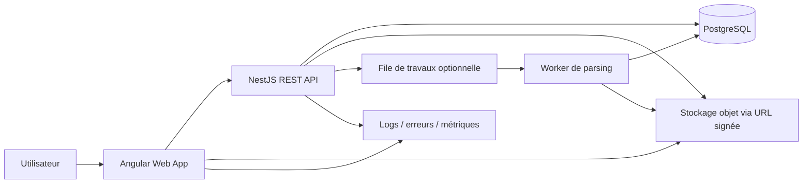
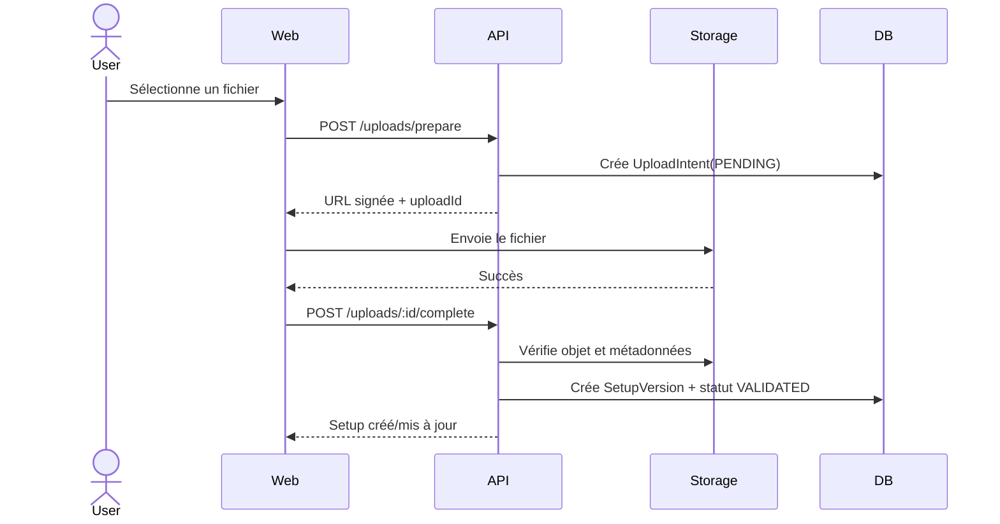

# 3. Architecture logicielle

## 3.1 Style d’architecture

Le système démarre comme un **monolithe modulaire** : une application Angular, une API NestJS et une base PostgreSQL. Cette approche limite la complexité opérationnelle tout en préparant une séparation future des traitements de fichiers ou de recherche.

Principes :

- séparation par domaine métier ;
- dépendances orientées vers le domaine ;
- stockage de fichiers découplé de la base ;
- traitements asynchrones optionnels et idempotents ;
- composants sans état pour le déploiement serverless.

## 3.2 Vue d’ensemble



## 3.3 Structure du monorepo

```text
apps/
  web/                    # Application Angular
  api/                    # Application NestJS
  worker/                 # Optionnel après MVP
packages/
  api-client/             # Client généré depuis OpenAPI
  contracts/              # Types et valeurs partagées sans dépendance framework
  ui/                     # Composants UI réutilisables Angular
  config-eslint/
  config-typescript/
  testing/
prisma/
  schema.prisma
  migrations/
docs/
  conception/
turbo.json
package.json
```

## 3.4 Frontend Angular

Organisation recommandée :

```text
src/app/
  core/
    auth/
    http/
    layout/
    error-handling/
  features/
    library/
    setup-detail/
    upload/
    compare/
    catalog/
    profile/
    admin/
  shared/
    ui/
    pipes/
    directives/
    utils/
```

Règles :

- composants standalone ;
- chargement différé par fonctionnalité ;
- Signals pour l’état local et services dédiés pour l’état métier partagé ;
- client API généré ;
- aucun accès direct à la base ou au stockage privé ;
- guards de navigation uniquement pour l’expérience utilisateur, jamais comme sécurité principale.

## 3.5 Backend NestJS

Modules :

```text
src/
  modules/
    auth/
    users/
    setups/
    setup-versions/
    uploads/
    catalog/
    references/
    ratings/
    comments/
    moderation/
  infrastructure/
    database/
    storage/
    observability/
    queue/
  common/
    guards/
    interceptors/
    filters/
    decorators/
```

Chaque domaine peut contenir :

- `controllers` : transport HTTP ;
- `application` : cas d’utilisation ;
- `domain` : règles, entités et politiques ;
- `infrastructure` : Prisma, stockage et services externes.

## 3.6 Découpage métier

### Users

Profil, préférences et cycle de vie du compte.

### Setups

Agrégat principal : identité logique, propriétaire, métadonnées, visibilité et version de référence.

### Setup Versions

Fichier immuable, données extraites, hash, notes de version et statistiques de performance.

### Uploads

Intentions d’upload, signatures, validation et nettoyage.

### Catalog

Projection de lecture des setups publics, filtres, tri et slug public.

### Community

Favoris, notes, commentaires et téléchargements.

### Moderation

Signalements, décisions et journal d’actions.

## 3.7 Flux d’import



## 3.8 Flux de téléchargement privé

1. Le client demande une URL de téléchargement.
2. L’API charge le setup et vérifie la politique d’accès.
3. L’API génère une URL signée de courte durée.
4. Le navigateur télécharge directement depuis le stockage.
5. Un événement de téléchargement est enregistré de manière non bloquante.

## 3.9 Stratégie de versionnement

- `Setup` représente la fiche logique.
- `SetupVersion` est immuable après validation du fichier.
- Modifier uniquement le titre ou les notes générales ne crée pas nécessairement de version.
- Remplacer le fichier crée toujours une nouvelle version.
- Une version peut être marquée comme référence.
- La suppression d’une version est logique tant qu’elle est référencée par des événements ou statistiques.

## 3.10 Cohérence et transactions

- Transaction DB pour créer simultanément setup, version et relation au fichier confirmé.
- Idempotency key sur la confirmation d’upload.
- Contrainte unique sur l’identifiant de stockage et le hash pertinent.
- Opérations externes conçues pour être reprises en cas d’échec.
- Suppression du blob uniquement après validation que plus aucune version active ne le référence.

## 3.11 Recherche

MVP : recherche PostgreSQL avec filtres et index.

Évolution : moteur dédié uniquement lorsque les mesures montrent un besoin réel, par exemple pour tolérance aux fautes, facettes avancées ou volume important.

## 3.12 Évolutions possibles

- Worker séparé pour parsing lourd.
- Application compagnon Tauri pour surveillance d’un dossier local.
- Webhooks Discord pour publication d’un setup.
- Groupes privés d’équipe.
- Recherche spécialisée.
- Service d’analyse télémétrique indépendant.
