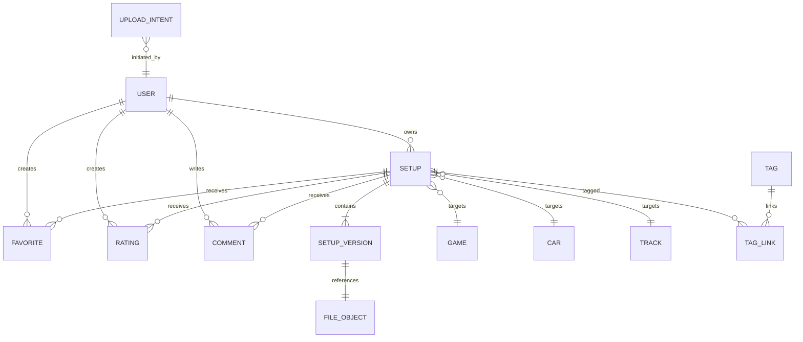

# 6. Modèle de données

## 6.1 Entités principales

## 6.2 Tables proposées

### User

- `id`
- `email`
- `displayName`
- `avatarUrl`
- `role`
- `status`
- `createdAt`
- `updatedAt`
- `deletedAt`

### Game

- `id`
- `slug`
- `name`
- `isActive`
- `supportedExtensions[]`

### CarCategory

- `id`
- `gameId`
- `name`

### Car

- `id`
- `gameId`
- `categoryId`
- `slug`
- `manufacturer`
- `name`
- `isActive`

### Track

- `id`
- `slug`
- `name`
- `layout`
- `countryCode`
- `isActive`

### Setup

- `id`
- `ownerId`
- `gameId`
- `carId`
- `trackId`
- `title`
- `slug`
- `descriptionPublic`
- `notesPrivate`
- `visibility`
- `sessionType`
- `weather`
- `trackTemperatureC`
- `airTemperatureC`
- `gameVersion`
- `referenceVersionId`
- `isArchived`
- `publishedAt`
- `createdAt`
- `updatedAt`
- `deletedAt`

### SetupVersion

- `id`
- `setupId`
- `versionNumber`
- `fileObjectId`
- `changeNotes`
- `parserName`
- `parserVersion`
- `parseStatus`
- `parsedData` JSONB
- `lapTimeMs`
- `fuelLiters`
- `fuelConsumptionPerLap`
- `createdAt`

### FileObject

- `id`
- `storageProvider`
- `storageKey`
- `originalName`
- `mimeType`
- `extension`
- `sizeBytes`
- `sha256`
- `status`
- `createdAt`
- `deletedAt`

### UploadIntent

- `id`
- `userId`
- `storageKey`
- `expectedSizeBytes`
- `expectedExtension`
- `status`
- `expiresAt`
- `completedAt`
- `createdAt`

### Tag / TagLink

Association plusieurs-à-plusieurs entre setups et tags normalisés.

### Favorite

Contrainte unique `(userId, setupId)`.

### Rating

- contrainte unique `(userId, setupId)` ;
- valeur entière entre 1 et 5.

### Comment

- `id`
- `setupId`
- `authorId`
- `body`
- `status`
- `createdAt`
- `updatedAt`
- `deletedAt`

### Report

- cible polymorphe limitée : setup ou commentaire ;
- auteur du signalement ;
- motif ;
- statut ;
- décision et modérateur.

### DownloadEvent

- `id`
- `setupId`
- `versionId`
- `actorUserId` nullable
- `occurredAt`
- données techniques minimisées et politique de rétention courte.

## 6.3 Index initiaux

- `Setup(ownerId, isArchived, updatedAt desc)`
- `Setup(visibility, publishedAt desc)`
- `Setup(gameId, carId, trackId, visibility)`
- `SetupVersion(setupId, versionNumber desc)` unique
- `Favorite(userId, setupId)` unique
- `Rating(userId, setupId)` unique
- `Comment(setupId, createdAt desc)`
- `UploadIntent(status, expiresAt)`
- `FileObject(storageKey)` unique
- `FileObject(sha256)` selon stratégie de déduplication

## 6.4 Choix JSONB

`parsedData` est stocké en JSONB pour supporter des paramètres différents selon les jeux. Les champs fréquemment filtrés restent relationnels. Aucun filtre produit critique ne doit dépendre d’une structure JSON non gouvernée sans index et schéma de validation.
